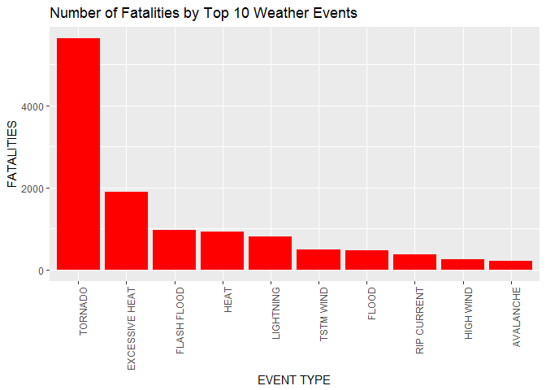
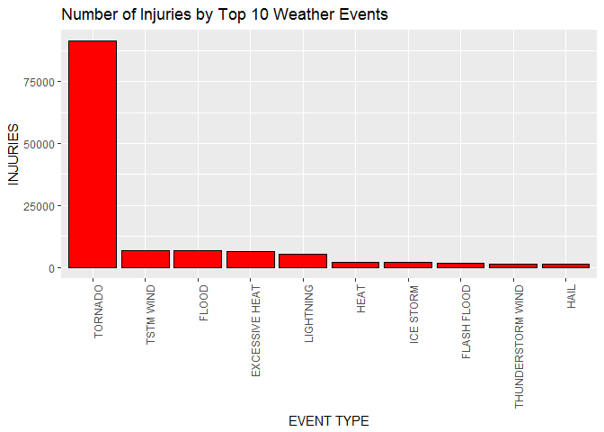
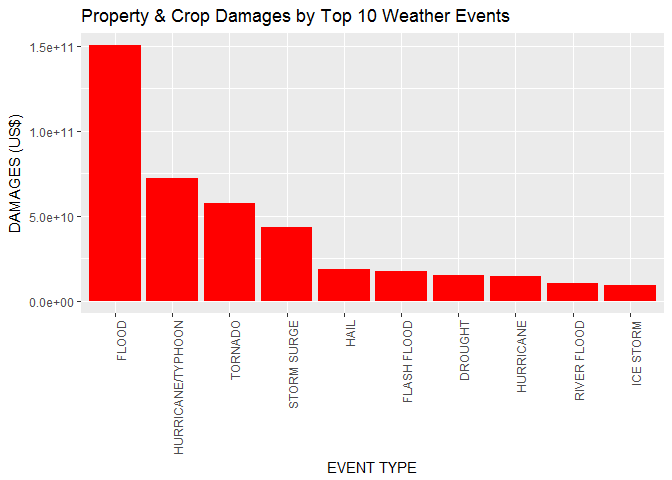

Coursera - Reproducible Research - Project 2
Chenthil Ramasamy
Wednesday, February 22, 2017
Exploring the NOAA Storm Database
Health and Economic impacts of Severe Weather in the US.
Assignment Brief
The basic goal of this assignment is to explore the NOAA Storm Database and answer some basic questions about severe weather events. You must use the database to answer the questions below and show the code for your entire analysis. Your analysis can consist of tables, figures, or other summaries. You may use any R package you want to support your analysis.
Synopsis
Storms and other severe weather events can cause both public health and economic problems for communities and municipalities.
This project involves exploring the U.S. National Oceanic and Atmospheric Administration's (NOAA) storm database. This database tracks characteristics of major storms and weather events in the United States, including when and where they occur, as well as estimates of any fatalities, injuries, and property damage.
The data analysis must address the following questions :
Across the United States, which types of events (as indicated in the EVTYPE variable) are most harmful with respect to population health ?
Across the United States, which types of events have the greatest economic consequences ?
This analysis shows by aggregating the data by storm events type :
Tornados are the most harmfull events on population health (including injury and fatalities).
Floods are responsible for the most economic damage.
Data Processing

```r
setwd("C:/Project2/")
mydata <- read.csv(bzfile("repdata_data_StormData.csv.bz2"), sep=",", header = TRUE)
# Looking into the various variables and indentifying the useful ones for this project
names(mydata)
```

```
##  [1] "STATE__"    "BGN_DATE"   "BGN_TIME"   "TIME_ZONE"  "COUNTY"    
##  [6] "COUNTYNAME" "STATE"      "EVTYPE"     "BGN_RANGE"  "BGN_AZI"   
## [11] "BGN_LOCATI" "END_DATE"   "END_TIME"   "COUNTY_END" "COUNTYENDN"
## [16] "END_RANGE"  "END_AZI"    "END_LOCATI" "LENGTH"     "WIDTH"     
## [21] "F"          "MAG"        "FATALITIES" "INJURIES"   "PROPDMG"   
## [26] "PROPDMGEXP" "CROPDMG"    "CROPDMGEXP" "WFO"        "STATEOFFIC"
## [31] "ZONENAMES"  "LATITUDE"   "LONGITUDE"  "LATITUDE_E" "LONGITUDE_"
## [36] "REMARKS"    "REFNUM"
```

```r
# Subsetting the storm data in the memory
submydata <- mydata[ , c('EVTYPE', 'FATALITIES', 'INJURIES', 'PROPDMG', 'PROPDMGEXP', 
                         'CROPDMG', 'CROPDMGEXP')]

# Convert H, K, M, B units to calculate Property Damage 
submydata$pd <- 0
submydata[submydata$PROPDMGEXP == "H", ]$pd <- 
  submydata[submydata$PROPDMGEXP == "H", ]$PROPDMG * 10^2

submydata[submydata$PROPDMGEXP == "K", ]$pd <- 
  submydata[submydata$PROPDMGEXP == "K", ]$PROPDMG * 10^3

submydata[submydata$PROPDMGEXP == "M", ]$pd <- 
  submydata[submydata$PROPDMGEXP == "M", ]$PROPDMG * 10^6

submydata[submydata$PROPDMGEXP == "B", ]$pd <- 
  submydata[submydata$PROPDMGEXP == "B", ]$PROPDMG * 10^9

# Converting the H, K, M, B into units to be able to calculate Crop Damage
submydata$cd <- 0

submydata[submydata$CROPDMGEXP == "H", ]$cd <- 
  submydata[submydata$CROPDMGEXP == "H", ]$CROPDMG * 10^2

submydata[submydata$CROPDMGEXP == "K", ]$cd <- 
  submydata[submydata$CROPDMGEXP == "K", ]$CROPDMG * 10^3

submydata[submydata$CROPDMGEXP == "M", ]$cd <- 
  submydata[submydata$CROPDMGEXP == "M", ]$CROPDMG * 10^6

submydata[submydata$CROPDMGEXP == "B", ]$cd <- 
  submydata[submydata$CROPDMGEXP == "B", ]$CROPDMG * 10^9
```

Analysis and Results
Across the United States, which types of events (as indicated in the EVTYPE variable) are most harmful with respect to population health ?

```r
library(ggplot2)
# Plotting the Number of Fatalities By the Most Harmful Event Types
fat <- aggregate(FATALITIES ~ EVTYPE, data = submydata, sum)
fat <- fat[order(-fat$FATALITIES), ][1:10, ]
fat$EVTYPE <- factor(fat$EVTYPE, levels = fat$EVTYPE)

ggplot(fat, aes(x = EVTYPE, y = FATALITIES)) + 
  geom_bar(stat = "identity", fill = "red", las = 3) +
  theme(axis.text.x = element_text(angle = 90, hjust = 1)) +
  xlab("EVENT TYPE") + ylab("FATALITIES") +
  ggtitle("Number of Fatalities by Top 10 Weather Events")
```

```
## Warning: Ignoring unknown parameters: las
```

<!-- -->

```r
# Plotting the Number of Injuries By the Most Harmful Event Types
inj <- aggregate(INJURIES ~ EVTYPE, data = submydata, sum)
inj <- inj[order(-inj$INJURIES), ][1:10, ]
inj$EVTYPE <- factor(inj$EVTYPE, levels = inj$EVTYPE)

ggplot(inj, aes(x = EVTYPE, y = INJURIES)) + 
  geom_bar(stat = "identity", fill = "red", las = 3, col= "black") + 
  theme(axis.text.x = element_text(angle = 90, hjust = 1)) + 
  xlab("EVENT TYPE") + ylab("INJURIES") + 
  ggtitle("Number of Injuries by Top 10 Weather Events")
```

```
## Warning: Ignoring unknown parameters: las
```

<!-- -->

Across the United States, which types of events have the greatest economic consequences ?

```r
# Plotting the Number of Damages Catagorized By the Most Harmful Event Types
dam <- aggregate(pd + cd ~ EVTYPE, data = submydata, sum)
names(dam) <- c("EVTYPE", "TDAMAGE")
dam <- dam[order(-dam$TDAMAGE), ][1:10, ]
dam$EVTYPE <- factor(dam$EVTYPE, levels = dam$EVTYPE)

ggplot(dam, aes(x = EVTYPE, y = TDAMAGE)) + 
    geom_bar(stat = "identity", fill = "red", las = 3) + 
    theme(axis.text.x = element_text(angle = 90, hjust = 1)) + 
    xlab("EVENT TYPE") + ylab("DAMAGES (US$)") +
  ggtitle("Property & Crop Damages by Top 10 Weather Events")
```

```
## Warning: Ignoring unknown parameters: las
```

<!-- -->

